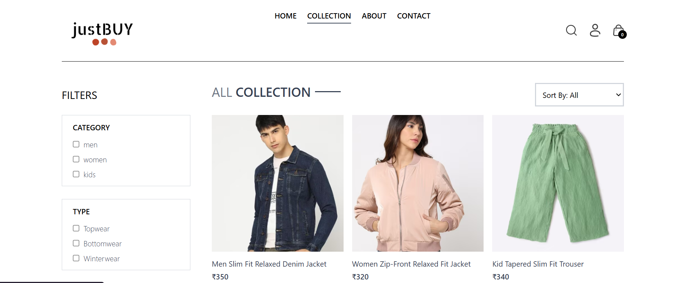
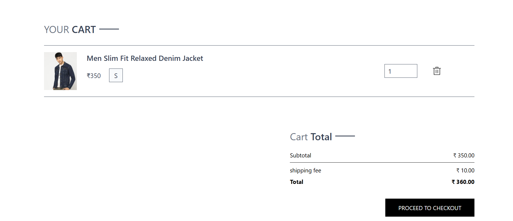
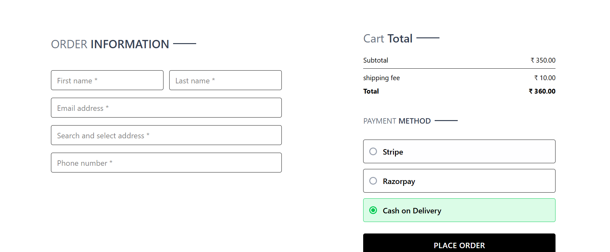
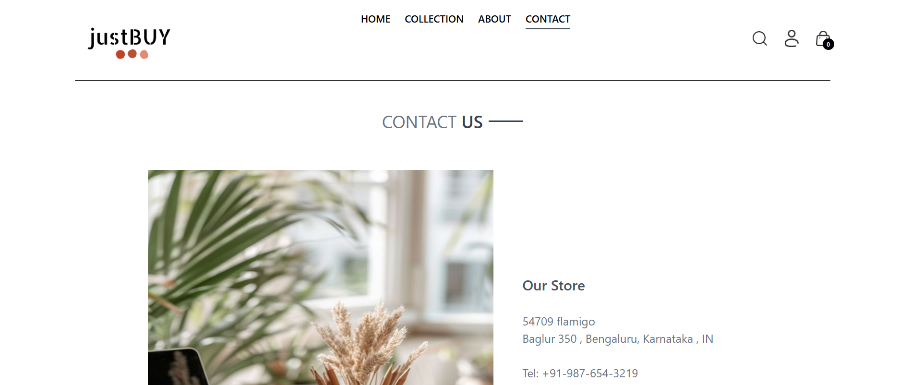

# justBUY - MERN E-Commerce Platform

A full-stack MERN e-commerce application with JWT authentication, Stripe/Razorpay integration, admin dashboard, and responsive UI.

---

## Features

- User Authentication
- Product Catalog
- Cart Management
- Stripe & Razorpay Payments
- Admin Dashboard
- Responsive Design

---

## Tech Stack

### Frontend
- React.js
- Tailwind CSS
- Context API

### Backend
- Node.js
- Express.js
- JWT Authentication

### Database
- MongoDB Atlas

### Deployment
- Vercel

---

## Installation

Clone the repository:

```bash
git clone https://github.com/sakshisaog/Ecommerce-app-mern.git
```

Install dependencies:

```bash
cd client
npm install

cd ../server
npm install
```

Run frontend:

```bash
npm run dev
```

Run backend:

```bash
npm start
```

## Screenshots

### Home Page


### Collection Page


### Cart Page


### Place Order Page


### About Page


### Contact Us Page

